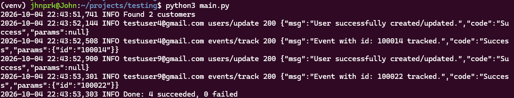
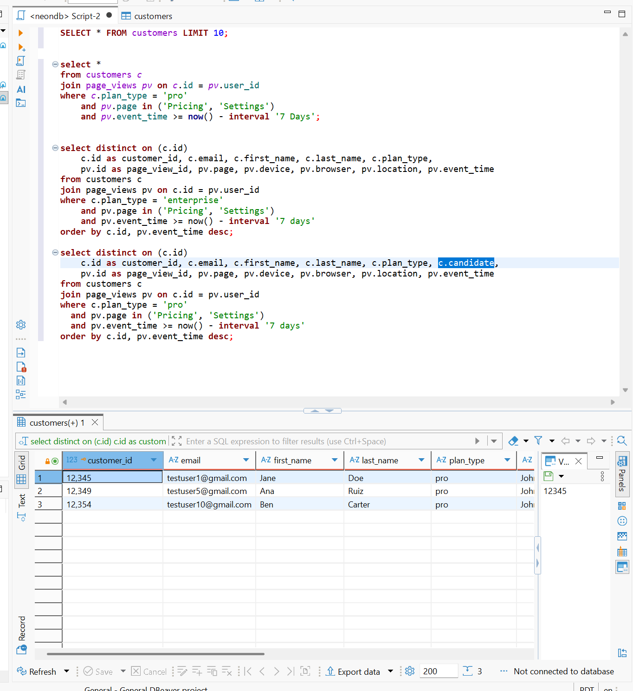
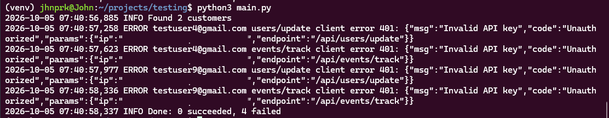

# Iterable Customer Activity Sync

**Technical Support Engineer Assessment — John**

A lightweight internal tool that pulls recent customer activity from Postgres and sends profile updates and `page_view` events to Iterable, so Product and Marketing can segment users and trigger campaigns based on in-app engagement.



## Walkthrough

1. [Approach](#1-approach)
2. [Database design](#2-database-design)
3. [Sample data](#3-sample-data)
4. [SQL logic](#4-sql-logic)
5. [Script structure and flow](#5-script-structure-and-flow)
6. [API request format](#6-api-request-format)
7. [Error handling and logging](#7-error-handling-and-logging)
8. [Production readiness](#8-production-readiness)
9. [Running it yourself](#9-running-it-yourself)

---

## 1. Approach

Build in small steps and prove each one works before adding the next:

1. Create the tables and sample data
2. Write and verify the SQL query in DBeaver
3. Connect from Python and print the query results
4. Send `users/update` for each customer
5. Send `events/track` for each customer
6. Organize into functions, then add error handling and logging

The commit history follows these same stages.

---

## 2. Database design

**Postgres, hosted on Neon.** It's a production-grade database, so nothing would change if this tool went live, and hosting it means the demo doesn't depend on a local setup.

Schema: [`sql/01_schema.sql`](sql/01_schema.sql)

| Table | Column | Decision | Why |
| --- | --- | --- | --- |
| `customers` | `email` | `NOT NULL UNIQUE` | Iterable identifies users by email; duplicates would be merged into one profile |
| `customers` | `plan_type` | `CHECK` free, basic, pro, enterprise | A typo like "Pro" can't silently break the plan filter |
| `page_views` | `user_id` | Foreign key to `customers(id)` | A page view can't point to a customer who doesn't exist |
| `page_views` | `event_time` | `TIMESTAMPTZ` | Stores the time zone, so the conversion to Iterable's Unix time is never a guess |

---

## 3. Sample data

Seed: [`sql/02_seed.sql`](sql/02_seed.sql)

- **15 customers** across all four plans
- **33 page views** across Home page, Pricing, Settings, Dashboard, Billing and Docs, with varied devices, browsers and locations

The data is designed so every filter in the query has a row that fails it.

Examples, using the enterprise plan from the query below:

| Case | Example | Result |
| --- | --- | --- |
| Right plan, qualifying view in the last 7 days | Sofia viewed Pricing 6 hours ago | Included |
| Right plan, but the qualifying view is too old, and the recent view is another page | Luis viewed Pricing 14 days ago and Dashboard yesterday | Excluded |
| Wrong plan, but viewed Pricing recently | Marcus (free) viewed Pricing yesterday | Excluded |
| Two qualifying views | Tom viewed Pricing 5 days ago and Settings 2 days ago | Included once, with the newer Settings view |

The other plans have the same kinds of cases, so the query can be demonstrated on any of them.

Page view times are generated **relative to now**, so the 7-day window always has data whenever the seed runs. The assessment's example used a fixed date, which would age out of the window.

---

## 4. SQL logic

```sql
select distinct on (c.id)
    c.id as customer_id, c.email, c.first_name, c.last_name, c.plan_type, c.candidate,
    pv.id as page_view_id, pv.page, pv.device, pv.browser, pv.location, pv.event_time
from customers c
join page_views pv on c.id = pv.user_id
where c.plan_type = 'enterprise'
  and pv.page in ('Pricing', 'Settings')
  and pv.event_time >= now() - interval '7 days'
order by c.id, pv.event_time desc;
```

| Requirement | How |
| --- | --- |
| Join customers and page views | `join page_views pv on c.id = pv.user_id` |
| Filter to one plan | `c.plan_type = 'enterprise'` |
| Pricing or Settings in the last 7 days | `pv.page in (...)` and `pv.event_time >= now() - interval '7 days'` |
| Metadata from the **latest** qualifying view | `distinct on (c.id)` keeps one row per customer; `order by pv.event_time desc` makes it the newest |

Without `distinct on`, a customer with two qualifying views appears twice and would be sent to Iterable twice. Columns are named instead of `select *`, because both tables have an `id` column.



---

## 5. Script structure and flow

Script: [`main.py`](main.py)

```
main()
 ├─ check DATABASE_URL and ITERABLE_API_KEY are set
 ├─ fetch_rows()                      → run the query, return rows
 └─ for each customer:
     ├─ send_to_iterable("users/update", build_user_payload(row))
     └─ send_to_iterable("events/track", build_event_payload(row))
 └─ log summary: X succeeded, Y failed
```

| Function | Job |
| --- | --- |
| `fetch_rows` | Connects, runs the query, closes the connection before any API calls |
| `build_user_payload` | Turns a row into the `users/update` body |
| `build_event_payload` | Turns a row into the `events/track` body |
| `send_to_iterable` | Sends one request, handles errors, logs the result |
| `main` | Ties it together |

---

## 6. API request format

Both calls are `POST` requests, authenticated with the `Api-Key` header.

**`POST /api/users/update`**

```json
{
  "email": "testuser4@gmail.com",
  "userId": "12348",
  "dataFields": {
    "firstName": "Tom",
    "lastName": "Becker",
    "planType": "enterprise",
    "candidate": "John",
    "recentPageView": true
  }
}
```

**`POST /api/events/track`**

```json
{
  "email": "testuser4@gmail.com",
  "userId": "12348",
  "eventName": "page_view",
  "id": "100014",
  "createdAt": 1790892266,
  "dataFields": {
    "page": "Settings",
    "device": "ThinkPad X1",
    "browser": "Firefox",
    "location": "New York, NY",
    "timestamp": "2026-10-01 22:04:26",
    "candidate": "John"
  }
}
```

| Field | Decision |
| --- | --- |
| `email` + `userId` | Both identifiers, as required; `userId` sent as a string, as Iterable expects |
| `firstName`, `lastName` | Iterable's built-in field names, so no duplicate fields are created |
| `candidate` | Included on both calls to identify these API calls |
| event `id` | The page view's database id: re-running updates the event instead of duplicating it |
| `createdAt` | When the view actually happened, in Unix seconds, not when the script ran |
| `timestamp` | Iterable's date format (`yyyy-MM-dd HH:mm:ss`). The project already defines this field as a date, and my first version's ISO format was rejected with a 400 |

---

## 7. Error handling and logging

- Every request has a **10-second timeout**, so the script can't hang.
- **Network errors** are caught and logged.
- **4xx** (our request is wrong) and **5xx** (Iterable's side) are logged with Iterable's response body, which says exactly what went wrong.
- **One failed call doesn't stop the run.** A summary shows the totals.
- Missing `.env` values stop the script up front with a clear message.

Run with an invalid API key:



---

## 8. Production readiness

1. **Configurable query.** Pass the plan and time window as `%s` parameters from the command line. Values are handled by the database driver, which also prevents SQL injection.
2. **JWT authentication.** Sign a short-lived token per user with a JWT-enabled Iterable key and send it as `Authorization: Bearer`. A leaked token expires quickly; a static key works until it's revoked.
3. **Scheduled runs with alerting.** Run on a schedule (for example, a cron job) and alert the team, such as in Slack, when the summary shows failures.

Also worth adding:

- Retry with backoff for timeouts, 429s and 5xx errors (not 4xx, which fail the same way every time)
- An index on `page_views(user_id, event_time)` for larger data
- Syncing only activity that hasn't been sent yet
- Iterable's bulk endpoints at scale
- A read-only database user, and masking emails in logs

---

## 9. Running it yourself

```bash
python3 -m venv venv
source venv/bin/activate
pip install -r requirements.txt
.env    # then fill in DATABASE_URL and ITERABLE_API_KEY
```

Run `sql/01_schema.sql` and `sql/02_seed.sql` against your database, then:

```bash
python main.py
```